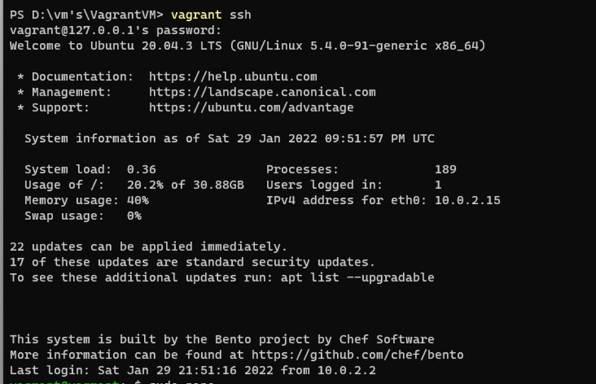
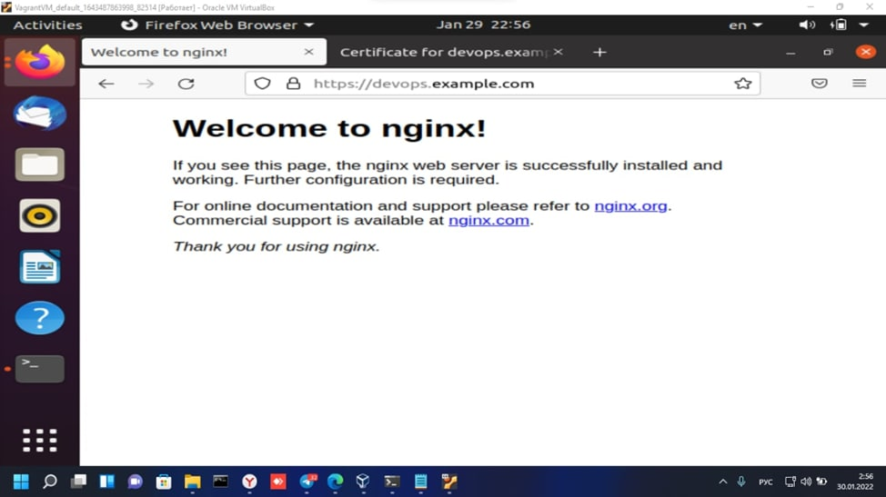
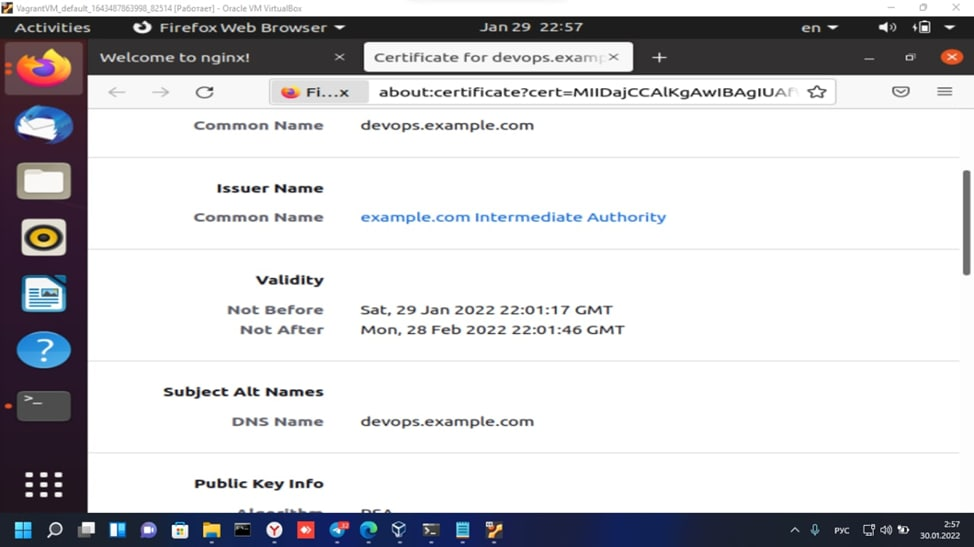
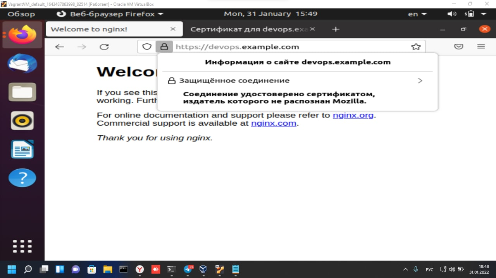
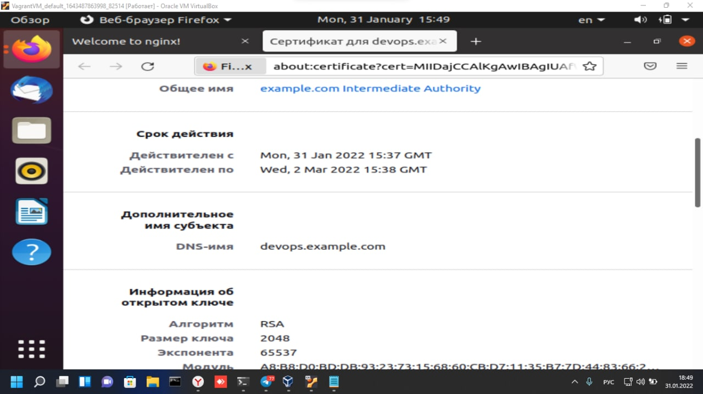

5.1. Введение в виртуализацию. Типы и функции гипервизоров. Обзор рынка вендоров и областей применения.
<details>
Задача 1: Опишите кратко, как вы поняли: в чем основное отличие полной (аппаратной) виртуализации, паравиртуализации и виртуализации на основе ОС.
```bash
Ответ:
Полная виртуализация:
Такой подход позволяет запускать только операционные системы, разработанные для той же архитектуры, что и у физического сервера (хоста). 

Паравиртуализация:
требует модификации кода гостевой ОС на уровне ядра, что позволяет ей общаться с гипервизором на более высоком уровне, обеспечивая более высокое быстродействие.

Виртуализация на основе ОС:
Виртуализация ресурсов на уровне ОС обеспечивает разделение одного физического сервера на несколько защищенных виртуализированных частей (контейнеров), каждая из которых представляется для владельца как один сервер. Виртуальная машина представляет собой окружение для приложений, запускаемых изолированно.
```
Задача 2 - Выберите один из вариантов использования организации физических серверов, в зависимости от условий использования.
```bash
ответ:
1. Условие: Высоконагруженная база данных, чувствительная к отказу.
    Организация: физические сервера
Почему: Постоянно нагруженной системе потребуется максимум ресурсов хоста, присутствие соседей которые могут их отобрать
2.  Условие: Различные web-приложения
     Организация: виртуализация уровня ОС
Почему: Виртуализация ОС подходит лучше всего, так свернуть приложение в контейнер и развернуть из него быстрей, чем делать это с виртуальными машинами с полноценной ОС и отдельным ядром.
3. Условие: Windows системы для использования бухгалтерским отделом
    Организация: паравиртуализация
Почему: эффективнее делать бэкап всей вирт. машины, возможность расширении ресурсов на уровне виртуальной машины. Так-же критичных требований к доступу к аппаратной составляющей сервера.
4. Условие: Системы, выполняющие высокопроизводительные расчеты на GPU
    Организация: виртуализация уровня ОС
Почему: виртуализация GPU может потребоваться в проектах с машинным обучением.
```
Задача 3: Выберите подходящую систему управления виртуализацией для предложенного сценария. Детально опишите ваш выбор.
```bash
Ответ:
1. 100 виртуальных машин на базе Linux и Windows, общие задачи, нет особых требований. Преимущественно Windows based инфраструктура, требуется реализация программных балансировщиков нагрузки, репликации данных и автоматизированного механизма создания резервных копий.
Ответ: Подойдут Hyper-V, vSphere. 
2. Требуется наиболее производительное бесплатное open source решение для виртуализации небольшой (20-30 серверов) инфраструктуры на базе Linux и Windows виртуальных машин.
Ответ: Proxmox в режиме KVM: open source решение, хорошо поддерживает Windows гостей
3. Необходимо бесплатное, максимально совместимое и производительное решение для виртуализации Windows инфраструктуры.
Ответ: Hyper-V Server, максимально совместим т.к. от Microsoft, полностью бесплатен.

4. Необходимо рабочее окружение для тестирования программного продукта на нескольких дистрибутивах Linux.
Ответ: LXD, т.к. содержит огромную библиотеку с разными дистрибутивами в большом количестве конфигураций в виде контейнеров.
```

4 задание. Опишите возможные проблемы и недостатки гетерогенной среды виртуализации (использования нескольких систем управления виртуализацией одновременно) и что необходимо сделать для минимизации этих рисков и проблем. Если бы у вас был выбор, то создавали бы вы гетерогенную среду или нет? Мотивируйте ваш ответ примерами.
```bash
Ответ:
Трудно управлять виртуалками в такой среде, особенно когда их надо обслуживать, перемещать, давать дополнительные ресурсы, когда возможно на одном сервере еще есть ресурсы, а на другом уже мало, а поделить не получится.
Поэтому конечно лучше когда все виртуалки в одной среде, тогда их администрирование гораздо проще, удобнее и дешевле.
```
</details>
Курсовая работа по итогам модуля "DevOps и системное администрирование"
<details>

###1. Создайте виртуальную машину Linux


###2. Установите ufw и разрешите к этой машине сессии на порты 22 и 443, при этом трафик на интерфейсе localhost (lo) должен ходить свободно на все порты.  
```bash
vagrant@vagrant:~$ sudo ufw status
Status: inactive
vagrant@vagrant:~$ sudo ufw allow 22
Rules updated
Rules updated (v6)
vagrant@vagrant:~$ sudo ufw allow 443
Rules updated
Rules updated (v6)
vagrant@vagrant:~$ sudo ufw enable
Command may disrupt existing ssh connections. Proceed with operation (y|n)? y
Firewall is active and enabled on system startup
vagrant@vagrant:~$ sudo ufw status
Status: active
 
To                     	Action  	From
--                     	------      ----
22                     	ALLOW   	Anywhere
443                    	ALLOW   	Anywhere
22 (v6)                	ALLOW   	Anywhere (v6)
443 (v6)               	ALLOW   	Anywhere (v6)

```

###3.Установите hashicorp vault (инструкция по ссылке).  
```bash
vagrant@vagrant:~$ curl -fsSL https://apt.releases.hashicorp.com/gpg | sudo apt-key add -
OK
vagrant@vagrant:~$ sudo apt-add-repository "deb [arch=amd64] https://apt.releases.hashicorp.com $(lsb_release -cs) main"
vagrant@vagrant:~$ sudo apt-get update && sudo apt-get install vault
vagrant@vagrant:~$ sudo vault
Usage: vault <command> [args]
 
Common commands:
	read    	Read data and retrieves secrets
	write   	Write data, configuration, and secrets
	delete  	Delete secrets and configuration
	list    	List data or secrets
	login   	Authenticate locally
	agent   	Start a Vault agent
	server  	Start a Vault server
	status  	Print seal and HA status
	unwrap  	Unwrap a wrapped secret
 
Other commands:
	audit      	Interact with audit devices
	auth       	Interact with auth methods
	debug      	Runs the debug command
	kv         	Interact with Vault's Key-Value storage
	lease      	Interact with leases
	monitor    	Stream log messages from a Vault server
    namespace  	Interact with namespaces
    operator   	Perform operator-specific tasks
    path-help  	Retrieve API help for paths
	plugin     	Interact with Vault plugins and catalog
	policy     	Interact with policies
	print      	Prints runtime configurations
	secrets    	Interact with secrets engines
	ssh        	Initiate an SSH session
	token      	Interact with tokens
```
###4.Cоздайте центр сертификации по инструкции (ссылка) и выпустите сертификат для использования его в настройке веб-сервера nginx (срок жизни сертификата - месяц).  
```bash
vagrant@vagrant:~$ sudo vault server -dev -dev-root-token-id A2mDQPiAZaxnGmcOPVYV4Mlo
==> Vault server configuration:
 
         	Api Address: http://127.0.0.1:8200
                     Cgo: disabled
     	Cluster Address: https://127.0.0.1:8201
          	Go Version: go1.17.5
              Listener 1: tcp (addr: "127.0.0.1:8200", cluster address: "127.0.0.1:8201", max_request_duration: "1m30s", max_request_size: "33554432", tls: "disabled")
               Log Level: info
                   Mlock: supported: true, enabled: false
           Recovery Mode: false
                 Storage: inmem
                 Version: Vault v1.9.3

```
```bash
root@vagrant:~# export VAULT_ADDR='http://127.0.0.1:8200'
root@vagrant:~# export VAULT_TOKEN=A2mDQPiAZaxnGmcOPVYV4Mlo
```
```bash
root@vagrant:~# vault status
Key             Value
---             -----
Seal Type       shamir
Initialized     true
Sealed          false
Total Shares    1
Threshold       1
Version         1.9.3
Storage Type    inmem
Cluster Name    vault-cluster-675bc514
Cluster ID      81eed5b0-c327-a6ff-d1d4-f12d3fb63913
HA Enabled      false
```
#####Root CA и Intermediate CA  
```bash
root@vagrant:~# vault secrets enable pki
Success! Enabled the pki secrets engine at: pki/
root@vagrant:~# vault secrets tune -max-lease-ttl=8760h pki
Success! Tuned the secrets engine at: pki/
root@vagrant:~# vault write -field=certificate pki/root/generate/internal common_name="example.com" ttl=87600h > CA_cert.crt
root@vagrant:~# vault write pki/config/urls issuing_certificates="http://127.0.0.1:8200/v1/pki/ca" crl_distribution_points="http://127.0.0.1:8200/v1/pki/crl"
Success! Data written to: pki/config/urls
root@vagrant:~# vault secrets enable -path=pki_int pki
Success! Enabled the pki secrets engine at: pki_int/
root@vagrant:~# vault secrets tune -max-lease-ttl=8760h pki_int
Success! Tuned the secrets engine at: pki_int/
root@vagrant:~# vault write -format=json pki_int/intermediate/generate/internal common_name="example.com Intermediate Authority" | jq -r '.data.csr' > pki_intermediate.csr
root@vagrant:~# vault write -format=json pki/root/sign-intermediate csr=@pki_intermediate.csr format=pem_bundle ttl="8760h" | jq -r '.data.certificate' > intermediate.cert.pem
root@vagrant:~# vault write pki_int/intermediate/set-signed certificate=@intermediate.cert.pem
Success! Data written to: pki_int/intermediate/set-signed
root@vagrant:~# vault write pki_int/roles/example-dot-com allowed_domains="example.com" allow_subdomains=true max_ttl="4380h"
Success! Data written to: pki_int/roles/example-dot-com
root@vagrant:~# vault list pki_int/roles/
Keys
----
example-dot-com
```
#####Создание сертификатов для devops.example.com  
```bash
root@vagrant:~# vault write -format=json pki_int/issue/example-dot-com common_name="devops.example.com" ttl=720h > devops.example.com.crt
root@vagrant:~# cat devops.example.com.crt
....
serial_number       01:f5:80:79:8c:02:44:1a:53:ff:10:5e:8c:fa:36:a3:63:e3:ae:f9
root@vagrant:~# cat devops.example.com.crt | jq -r .data.certificate > devops.example.com.crt.pem
root@vagrant:~# cat devops.example.com.crt | jq -r .data.issuing_ca >> devops.example.com.crt.pem
root@vagrant:~# cat devops.example.com.crt | jq -r .data.private_key > devops.example.com.crt.key
```
###5. Установите корневой сертификат созданного центра сертификации в доверенные в хостовой системе.  
```bash
root@vagrant:~# ln -s /root/CA_cert.crt /usr/local/share/ca-certificates/CA_cert.crt
root@vagrant:~# update-ca-certificates
Updating certificates in /etc/ssl/certs…
1 added, 0 removed; done.
Running hooks in /etc/ca-certificates/update.d…
done
```
###6.Установите nginx.  
```bash
root@vagrant:~# apt install nginx
root@vagrant:~# systemctl status nginx
● nginx.service - A high performance web server and a reverse proxy server
 	Loaded: loaded (/lib/systemd/system/nginx.service; enabled; vendor preset: enabled)
 	Active: active (running) since Sat 2022-01-29 22:03:14 UTC; 2h 31min ago
   	Docs: man:nginx(8)
	Process: 15797 ExecReload=/usr/sbin/nginx -g daemon on; master_process on; -s reload (code=exited, status=0/SUCCESS)
   Main PID: 3261 (nginx)
  	Tasks: 3 (limit: 1106)
 	Memory: 8.5M
 	CGroup: /system.slice/nginx.service
         	├─ 3261 nginx: master process /usr/sbin/nginx -g daemon on; master_process on;
      	   ├─15798 nginx: worker process
             └─15799 nginx: worker process
Jan 29 23:25:31 vagrant systemd[1]: Reloading A high performance web server and a reverse proxy server.
Jan 29 23:25:31 vagrant systemd[1]: Reloaded A high performance web server and a reverse proxy server.
Jan 29 23:37:49 vagrant systemd[1]: Reloading A high performance web server and a reverse proxy server.
root@vagrant:~# nano /etc/hosts
127.0.0.1       localhost
127.0.1.1       vagrant.vm  	vagrant
127.0.0.1       devops.example.com
 # The following lines are desirable for IPv6 capable hosts
::1     localhost ip6-localhost ip6-loopback
ff02::1 ip6-allnodes
ff02::2 ip6-allrouters
```
###7.По инструкции (ссылка) настройте nginx на https, используя ранее подготовленный сертификат:  
    -можно использовать стандартную стартовую страницу nginx для демонстрации работы сервера;  
    -можно использовать и другой html файл, сделанный вами;  
```bash
root@vagrant:~# nano /etc/nginx/sites-enabled/default
server {
	listen          	443 ssl;
    server_name         test.example.com;
	ssl_certificate 	/root/devops.example.com.crt.pem;
    ssl_certificate_key /root/devops.example.com.crt.key;
    ssl_protocols   	TLSv1 TLSv1.1 TLSv1.2;
    ssl_ciphers         HIGH:!aNULL:!MD5;
}
 root@vagrant:~# nginx -t
nginx: the configuration file /etc/nginx/nginx.conf syntax is ok
nginx: configuration file /etc/nginx/nginx.conf test is successful
root@vagrant:~# systemctl reload nginx
root@vagrant:~# curl -I https://devops.example.com
HTTP/1.1 200 OK
Server: nginx/1.18.0 (Ubuntu)
Date: Sun, 30 Jan 2022 00:38:43 GMT
Content-Type: text/html
Content-Length: 612
Last-Modified: Tue, 21 Apr 2020 14:09:01 GMT
Connection: keep-alive
ETag: "5e9efe7d-264"
Accept-Ranges: bytes
```
###8.Откройте в браузере на хосте https адрес страницы, которую обслуживает сервер nginx.  


###9.Создайте скрипт, который будет генерировать новый сертификат в vault:  
```bash
root@vagrant:~# nano sert.sh
#!/bin/bash
vault write -format=json pki_int/issue/example-dot-com common_name="devops.example.com" ttl=720h > /root/devops.example.com.crt
cat /root/devops.example.com.crt | jq -r .data.certificate > /root/devops.example.com.crt.pem
cat /root/devops.example.com.crt | jq -r .data.issuing_ca >> /root/devops.example.com.crt.pem
cat /root/devops.example.com.crt | jq -r .data.private_key > /root/devops.example.com.crt.key
systemctl reload nginx
root@vagrant:~# chmod ugo+x sert.sh
```


###10.Поместите скрипт в crontab, чтобы сертификат обновлялся какого-то числа каждого месяца в удобное для вас время.  
```bash
root@vagrant:~# crontab –l
# m h  dom mon dow   command
0 1 * * sat /scripts/test.sh
root@vagrant:~#
```
</details>
Домашнее задание к занятию "4.1. Командная оболочка Bash: Практические навыки"
<details>

1. Есть скрипт. Какие значения переменным c,d,e будут присвоены? Почему?

*c=a+b вернёт a+b т.к. a и b указаны без символа $, а символ + воспринимается как оператор только в арифметических операциях

*d=$a+$b вернёт 1+2, т.к. a и b указаны с символом $ и будут восприняты как обращения к переменным  

*e=$(($a+$b)) вернёт 3, т.к. конструкция ((..)) служит для арифметических операций  

2. На нашем локальном сервере упал сервис и мы написали скрипт, который постоянно проверяет
его доступность, записывая дату проверок до тех пор, пока сервис не станет недоступным (после чего скрипт долэен завершится).
В скрипте допущена ошибка, из-за которой выполнение не может завершиться, при этом место на Жёстком Диске
постепенно уменьшается. Что необходимо сделать чтобы его исправить:  
В первой строке пропущена скобка в ((1=1)) и отсутствовало условие выхода esle break.
```bash
    while ((1==1))
    do
            curl -ss http://localhost:4757  
            if (($? != 0))  
            then  
                 date >> curl.log  
    else    
    break  
    fi  
    done
```
Необходимо написать скрипт, который проверяет доступность трёх IP: 192.168.0.1, 173.194.222.113, 87.250.250.242
по 80 порту и записывает результат в файл log. Проверять доступность необходимо 5 раз для каждого узла.  
 ```bash
 declare -i keep_checking=1
    while (($keep_checking<=5))
    do
        for host in 192.168.0.1 173.194.222.113 87.250.250.242; do 
            nc -zw1 $host 80
            echo $? $host `date` >> 4-01-3.log
        done
    keep_checking+=1
    sleep 1
    done
```
3. Необходимо дописать скрипт из пердыдущего задания так, чтобы он выполнялся до тех пор, пока один из узлов не 
   окажется недоступным. Если любой из узлов недоступен - IP этого узла пишется в файл error, скрипт прерывается.
```bash
    declare -i keep_checking=1  
    while (($keep_checking==1))  
    do 
        for host in 192.168.0.1 173.194.222.113 87.250.250.242; do  
            nc -zw1 $host 80  
            if (($?==0))  
            then  
                echo $? $host `date` >> 26-12-21.log  
            else  
                echo $host >> error.log  
                keep_checking=0  
            fi  
        done  
    sleep 1  
    done
```
</details>